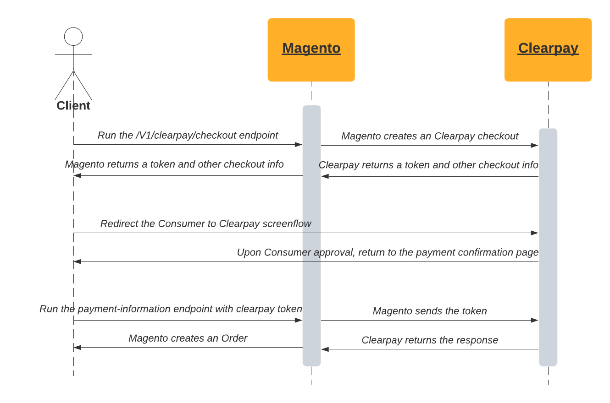

# Clearpay Rest API support

The Clearpay module provides the possibility to retrieve an Clearpay checkout token and use Clearpay payment method via REST API.

## Clearpay workflow

The following diagram shows the workflow for placing an order when Clearpay is the selected payment method.


## Usage

Please refer to the [Magento Rest API Order processing tutorial](https://devdocs.magento.com/guides/v2.4/rest/tutorials/orders/order-intro.html) for the general approach.

To be able to pay via Clearpay in your frontend, you are required to create an Clearpay checkout. This needs to happen *after* you set all required cart data.

The endpoint to create an Clearpay checkout looks like this:

**Endpoint:** `POST <host>/rest/<store_code>/V1/clearpay/checkout`<br/>
**Headers:** `Content-Type: application/json`<br/>
**Payload:**
```
{
 "cart_id": "{ CART_ID }",
 "redirectPath":{
   "confirm_path": "some/confirm/path",
   "cancel_path": "some/cancel/path"
 }
}
```
The input is masked cart id (for guest user) or quote id (for logged-in user) and urls to return when Consumer completes the Clearpay screenflow. The successful output will look like this:

```
{
 "clearpay_token": "{ CLEARPAY_TOKEN }",
 "clearpay_expires": "2021-08-03T15:44:28.728Z",
 "clearpay_redirectCheckoutUrl": "https://portal.sandbox.clearpay.com/us/checkout/?token={ CLEARPAY_TOKEN }"
}
```

Retrieved data will be needed for two things (shold be done in following sequence):
1. The Consumer must go through the Clearpay screenflow by `clearpay_redirectCheckoutUrl` *before* order placement operation
    - If the Consumer clicks "confirm", they will be returned to the Merchant website (to `confirm_url` which was passed in `clearpay/checkout` endpoint) with the orderToken and a status of "SUCCESS".
    - If the Consumer cancels, they will be returned to the Merchant website (to `cancel_url` which was passed in `clearpay/checkout` endpoint) with the orderToken and a status of "CANCELLED".
2. The `clearpay_token` must be used when you are setting the payment method on the cart. Hence, the **payment-information** endpoint should look like this:
```
{
 "email": "***",
 "paymentMethod": {
   "method": "clearpay",
   "additional_data": {
     "clearpay_token": "{ CLEARPAY_TOKEN }" 
   }
 },
 "billing_address": { *** }
} 
```

## Error handling

Any errors on the Clearpay side will be exposed in the response, eg:

```
{
    "message": "Unable to place order: Transaction has been declined. Please try again later."
}
```

Any Magento errors will also appear in the same manner, eg:

```
{
    "message": "Could not find a cart with ID { CART_ID }"
}
```
